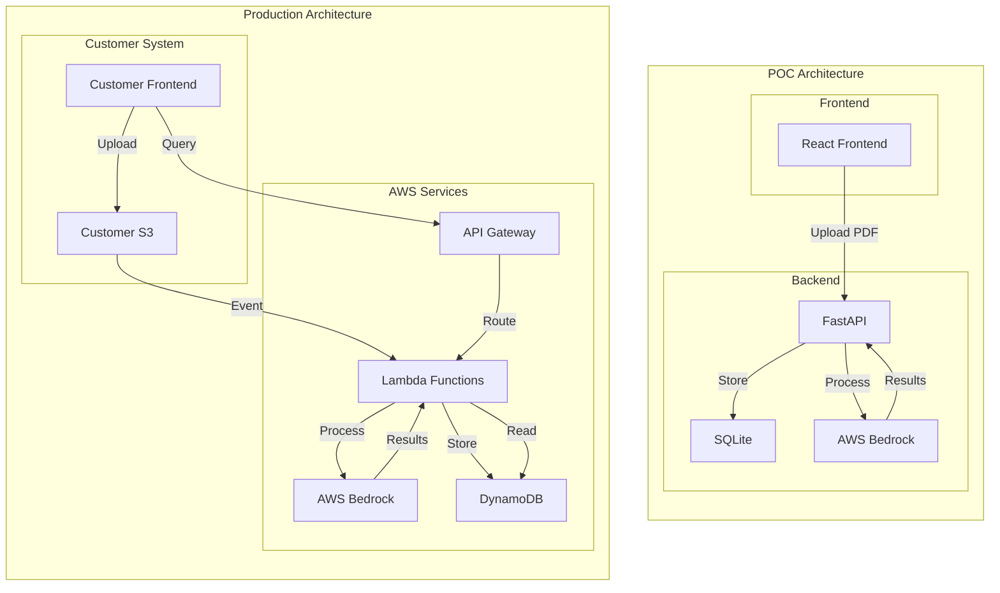

## Document Tagging and Summary System (Production)

## Project Brief
This document only outlines the PROPOSED production architecture for the Document Analysis and Tagging System. The production implementation is designed to be deployed as a separate service in the customer's AWS account, integrating with their existing document management system.

> **Note:** This document only outlines the PROPOSED AWS production architecture for implementing this solution. The current code in this repo is a PoC for demonstration purposes only, and was built to run in a local non-AWS dev environment (e.g., React, FastAPI, SQLite, etc.) as detailed in the official repository's [README.md](README.md). Refer to that file if you want to install and run this project in a local non-AWS environment.


**Objective:**
- Enable customers to upload PDF documents via their existing UI to S3.
- Automatically process documents using AWS Lambda, converting PDFs to images and analyzing them with AWS Bedrock.
- Generate 2–3 descriptive tags per document, prioritizing a provided organizational tag library.
- Produce a concise summary for each document.
- Store results in DynamoDB and provide secure access via API Gateway.

**How it works:**
- Customer UI uploads PDFs to S3.
- S3 triggers a Lambda function that converts the PDF to images and sends them to AWS Bedrock for analysis.
- The AI assigns the most relevant tags from the tag library (creating new tags only if needed) and generates a summary.
- Results are stored in DynamoDB and accessed securely via API Gateway endpoints.

**Tagging & Summarization Logic:**
- Prefer existing tags; only create new tags if necessary (max 2–3 per document).
- Prevent semantic overlap/duplication in new tags.
- Maintain a clear, reusable tag library for consistent document organization.

---


## Technical Architecture: POC Architecture vs Proposed Production


## Sequence Diagram

```mermaid
%%{init: {'theme': 'base', 'themeVariables': { 'primaryColor': '#232F3E', 'primaryTextColor': '#fff', 'primaryBorderColor': '#232F3E', 'lineColor': '#232F3E', 'secondaryColor': '#232F3E', 'tertiaryColor': '#232F3E'}}}%%
sequenceDiagram
    participant User as fa:fa-user User
    participant Frontend as fa:fa-desktop Frontend
    participant "API Gateway" as fa:fa-aws-api-gateway API Gateway
    participant Lambda as fa:fa-aws-lambda Lambda
    participant S3 as fa:fa-aws-s3 S3
    participant "Bedrock (LLM)" as fa:fa-aws-bedrock Bedrock (LLM)
    participant DynamoDB as fa:fa-aws-dynamodb DynamoDB

    User->>Frontend: Upload PDF
    Frontend->>API Gateway: Send PDF
    API Gateway->>Lambda: Trigger Lambda
    Lambda->>S3: Store PDF
    Lambda->>Lambda: Convert PDF to images
    Lambda->>Bedrock (LLM): Send images for analysis/tagging
    Bedrock (LLM)-->>Lambda: Return tags & summary
    Lambda->>DynamoDB: Store results
    Lambda->>API Gateway: Return tags & summary
    API Gateway->>Frontend: Return tags & summary
    Frontend->>User: Display results
```

## Key Differences

### POC Architecture
- Uses FastAPI for backend API
- SQLite for data storage
- Direct integration with AWS Bedrock
- Simple React frontend
- Local file processing

### Production Architecture
- Serverless architecture using AWS Lambda
- DynamoDB for scalable data storage
- API Gateway for secure API access
- S3 for document storage
- Event-driven processing
- Customer's existing frontend integration

---

## Overview
The production system provides:
- Automated document processing via S3 triggers
- Secure API access to processed results
- Integration with customer's existing UI
- Scalable serverless architecture
- Configurable AI analysis via AWS Bedrock

## Key Features
- PDF Processing: Converts PDFs to images for AI analysis
- Smart Tag Selection: Prioritizes existing tags, prevents duplication
- Document Summarization: Generates concise summaries
- Tag Management: Organizes tags into logical groups
- Secure API Access: Protected endpoints for data retrieval

## System Components

### Backend Components
- API Gateway for:
  - Secure API endpoints
  - Request validation
  - Rate limiting
  - Authentication/Authorization
- Lambda Functions:
  - Processing Lambda:
    - Triggered by S3 upload events
    - PDF processing and image conversion
    - Page-by-page image optimization
    - LLM context management
    - AI interaction and result generation
    - DynamoDB updates
  - Query Lambda:
    - Secure data access
    - Response formatting
    - Caching when appropriate
- DynamoDB for:
  - Document metadata and summaries
  - Tag definitions and groups
  - Document-tag relationships
- AWS S3 integration for:
  - Document storage
  - Tag group configuration
- AWS Bedrock integration for:
  - Configurable LLM selection
  - Document analysis and summarization
  - Tag generation

### Tag Management Strategy
- Tag Library:
  - Predefined set of tags stored in S3
  - Organized into logical groups
  - Used as the primary source for tag assignment
- Tag Selection Rules:
  - Must use existing tags from library when applicable
  - New tags are created only when no existing tags match
  - Maximum of 2-3 new tags per document
  - New tags must be:
    - General and reusable (not document-specific)
    - 1-2 words maximum
    - Non-overlapping with existing tags
    - Domain-appropriate (prefer domain-specific over general tags)
- Tag Consistency:
  - Prevents tag sprawl and duplication
  - Maintains semantic clarity
  - Ensures consistent categorization
  - Facilitates better document organization

### Document Processing Pipeline
1. S3 Upload: Documents are uploaded to S3 through customer's existing UI
2. Lambda Trigger: S3 upload event triggers Processing Lambda
3. PDF Processing: 
   - PDF is converted to a series of JPEG images (one per page)
   - Images are optimized for size and quality
   - This approach serves as a form of page chunking to manage LLM context window limits
4. AI Analysis: 
   - All page images are sent to AWS Bedrock to represent a single document
   - LLM processes the complete set of images to understand the full document context
   - This allows the AI to maintain document coherence while working within token limits
   - Tag selection follows strict rules:
     - Primary preference for existing tags
     - Limited creation of new tags (2-3 max)
     - Enforcement of tag naming conventions
5. Results Generation: AI generates both summary and tags based on the complete document understanding
6. Storage: Lambda stores results in DynamoDB
7. Data Access: Customer's UI queries through API Gateway

### API Endpoints
The following endpoints are available for secure data access:

1. Document Management:
   - `GET /api/documents` - List all documents with metadata
   - `GET /api/documents/{id}` - Get specific document details
   - `GET /api/documents/{id}/summary` - Get document summary
   - `GET /api/documents/{id}/tags` - Get document tags

2. Tag Management:
   - `GET /api/tags` - List all available tags
   - `GET /api/tags/{id}` - Get specific tag details
   - `GET /api/tags/{id}/documents` - Get documents with specific tag

All endpoints require proper authentication and authorization.

## Deployment & Integration
- Solution is deployed as a CloudFormation/SAM template
- Customer provides:
  - S3 bucket for document storage
  - IAM roles for Lambda execution
  - API Gateway configuration
  - AWS Bedrock model configuration
- Integration requires:
  - API Gateway endpoint URL
  - API key or IAM credentials
  - S3 bucket name for document storage
  - Bedrock model selection and configuration

## Security Considerations
1. API Gateway:
   - API key authentication
   - IAM authorization
   - Request validation
2. Lambda:
   - Least privilege IAM roles
   - VPC configuration if needed
   - Environment variable encryption
3. DynamoDB:
   - Encryption at rest
   - Fine-grained access control
4. S3:
   - Bucket policies
   - Encryption at rest
   - Secure transfer

## Production Considerations
For production deployment, consider:
1. Implementing proper authentication and authorization
2. Setting up proper CORS configuration
3. Implementing proper error handling and logging
4. Setting up monitoring and alerting
5. Implementing rate limiting and request validation
6. Setting up proper backup and disaster recovery procedures
7. Optimizing PDF processing for production load
8. Setting up monitoring for document processing pipeline
9. Implementing proper cleanup of temporary files
10. Setting up CloudWatch alarms and metrics
11. Implementing proper retry mechanisms
12. Setting up proper logging and tracing

