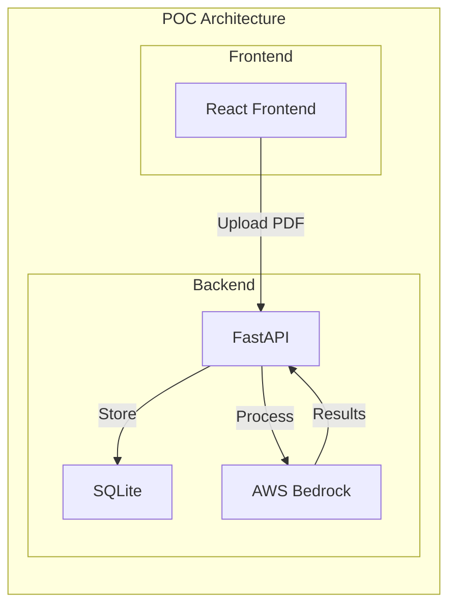
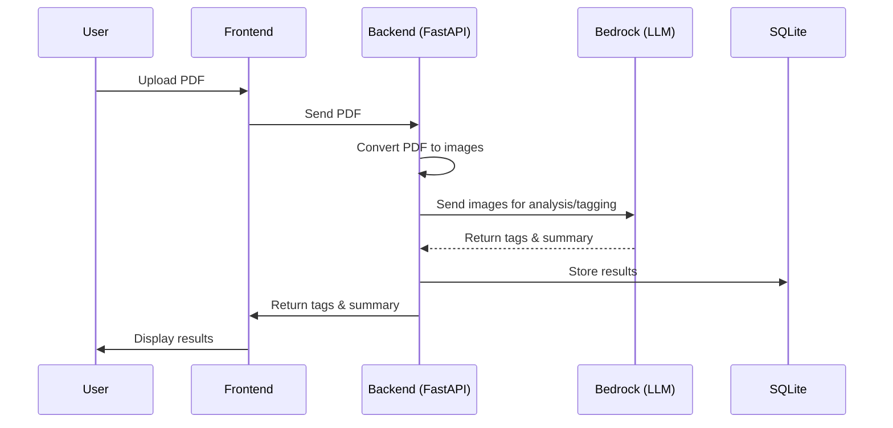

# Document Tagging and Summary System

## Project Brief

This project automatically generates tags and summaries for uploaded PDF documents using a smart tag library and AI analysis.

> **Note:** The current Proof of Concept (PoC) code in this repo is for demonstration purposes only, and was built to run in a local non-AWS dev environment (e.g., React, FastAPI, SQLite, etc.) To see proposed AWS production architecture for implementing this solution see [PROPOSED_AWS_PRODUCTION_ARCHITECTURE.md](PROPOSED_AWS_PRODUCTION_ARCHITECTURE.md)

**Objective:**
- Upload PDF documents via a React frontend to a FastAPI backend.
- Generate 2–3 descriptive tags per document, prioritizing a provided organizational tag library.
- Produce a concise summary for each document.

**How it works:**
- Users upload PDFs through the web interface.
- The backend (FastAPI) saves the PDF, converts each page to a JPEG image, and sends all images to AWS Bedrock for analysis.
- The AI assigns the most relevant tags from the tag library (creating new tags only if needed) and generates a summary.
- Results are stored in SQLite and displayed in the frontend for exploration and filtering.

**Tagging & Summarization Logic:**
- Prefer existing tags; only create new tags if necessary (max 2–3 per document).
- Prevent semantic overlap/duplication in new tags.
- Maintain a clear, reusable tag library for consistent document organization.


## Overview
This POC demonstrates:
- PDF document upload and processing
- Automatic tag generation and assignment
- Document summarization
- Tag management and organization
- Interactive document exploration

## Key Features
- PDF Processing: Converts PDFs to images for AI analysis
- Smart Tag Selection: 
  - Prioritizes existing tags from the tag library
  - Prevents tag duplication and semantic overlap
  - Creates new tags only when necessary (max 2-3 per document)
  - Enforces consistent tag naming conventions
- Document Summarization: Generates concise summaries
- Tag Management: Organizes tags into logical groups
- Interactive UI: React-based interface for testing

### System Architecture



### Sequence Diagram


## System Components

### Frontend Components
- React application for:
  - Document upload and management
  - Tag visualization and management
  - Document exploration
  - Summary viewing
  - Tag-based document filtering
  - Document selection and details view

### Backend Components
- FastAPI Server for:
  - API endpoints
  - Request handling
  - Response formatting
  - PDF processing and image conversion
  - Page-by-page image optimization
  - LLM context management
  - AI interaction and result generation
  - SQLite updates
- SQLite Database with SQLAlchemy ORM:
  - Documents table:
    - id (Integer, primary key)
    - filename (String, unique)
    - summary (Text)
  - Tags table:
    - id (Integer, primary key)
    - name (String, unique)
    - group (String)
  - Document-Tags join table:
    - document_id (Integer, foreign key)
    - tag_id (Integer, foreign key)
- AWS S3 integration for:
  - Document storage
  - Tag group configuration
- AWS Bedrock integration for:
  - Configurable LLM selection
  - Document analysis and summarization
  - Tag generation

### Tag Management Strategy
- Tag Library:
  - Predefined set of tags stored in S3
  - Organized into logical groups
  - Used as the primary source for tag assignment
- Tag Selection Rules:
  - Must use existing tags from library when applicable
  - New tags are created only when no existing tags match
  - Maximum of 2-3 new tags per document
  - New tags must be:
    - General and reusable (not document-specific)
    - 1-2 words maximum
    - Non-overlapping with existing tags
    - Domain-appropriate (prefer domain-specific over general tags)
- Tag Consistency:
  - Prevents tag sprawl and duplication
  - Maintains semantic clarity
  - Ensures consistent categorization
  - Facilitates better document organization

### Document Processing Pipeline
1. Upload: Documents are uploaded through the React frontend
2. Processing: FastAPI handles document processing
3. PDF Processing: 
   - PDF is converted to a series of JPEG images (one per page)
   - Images are optimized for size and quality
   - This approach serves as a form of page chunking to manage LLM context window limits
4. AI Analysis: 
   - All page images are sent to AWS Bedrock to represent a single document
   - LLM processes the complete set of images to understand the full document context
   - This allows the AI to maintain document coherence while working within token limits
   - Tag selection follows strict rules:
     - Primary preference for existing tags
     - Limited creation of new tags (2-3 max)
     - Enforcement of tag naming conventions
5. Results Generation: AI generates both summary and tags based on the complete document understanding
6. Storage: Results are stored in SQLite
7. Data Access: Frontend queries through FastAPI

### API Endpoints
The following endpoints are available:

1. Document Management:
   - `POST /process-document` - Upload and process new document
   - `GET /documents` - List all documents with metadata
   - `GET /documents/{id}` - Get specific document details
   - `POST /reset-documents` - Reset document database (development only)

2. Tag Management:
   - `GET /tags` - List all available tags

## Development Setup

This project was built with and and runs with a [VS Code devcontainer](https://code.visualstudio.com/docs/devcontainers/containers). This [development-devcontainer-project-template](https://github.com/Baalakay/development-devcontainer-project-template) was used to build this project which already contains many of the dependencies required for this code repo, and automatically installs the libraries via uv (or Python) and npm (for React, Vite, Tailwinds, etc). See the README there if you are new to devcontainers and prefer to just use the [global devcontainer config](https://github.com/Baalakay/development-devcontainer-shared-config-template.git) that was used with this repo. Cloning this repo + that global devcontainer config provides everything you need to run this project.

### Prerequisites
- [development-devcontainer-project-template](https://github.com/Baalakay/development-devcontainer-project-template) \
(or install all relevant packages and libraries from that repo's devconfig.json, Docker file, and post-create.sh on your host instead, plus the relevant packages in this projects [pyproject.toml](pyproject.toml) and [package.json](frontend/package.json) )
- Python 3.12+
- Node.js 16+
- AWS CLI configured with appropriate credentials
- AWS Bedrock access

### To Start The Backend Server (FastAPI)

   ```bash
   uvicorn src.backend:app --reload
   ```

### To Start The Frontend Server (Vite)

   ```bash
   cd frontend && npm run dev -- --host --port=5173
   ```
